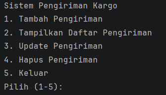
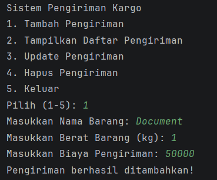
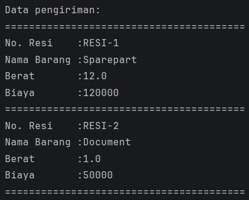
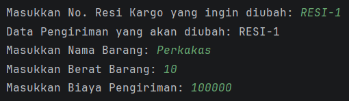
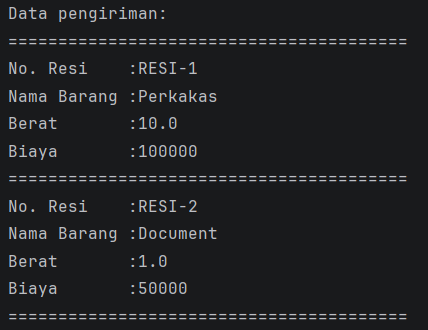
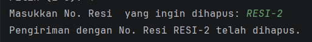
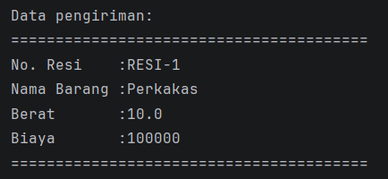

# LAPORAN POSTTEST 2

Proyek ini adalah system aplikasi manajeman pengiriman kargo menggunakan bahasa Java dengan konsep Object Orientation Programming (OOP)

## Identitas

Nama: Muhammad Haykal Makhmud
<br>
NIM: 2409106005

## Deskripsi Program

Program ini merupakan sistem manajemen pengiriman kargo yang dibuat menggunakan bahasa pemrograman Java dengan menerapkan konsep Object-Oriented Programming (OOP). Program ini dirancang untuk mengelola data pengiriman barang dengan operasi Create, Read, Update, dan Delete (CRUD).

**Fitur Utama:**

- Menggunakan class `Pengiriman` untuk menyimpan data setiap pengiriman
- Menyimpan semua data pengiriman dalam `ArrayList`
- Setiap pengiriman memiliki data: nomor resi, nama barang, berat barang (kg), dan biaya pengiriman (Rp)
- Nomor resi dibuat secara otomatis dengan format "RESI-X" (X adalah nomor urut)
- Dapat mencari dan mengubah data berdasarkan nomor resi

## Penerapan Konsep OOP

### 1. Encapsulation (Enkapsulasi)

Program ini menerapkan Encapsulation dengan menggunakan minimal 2 jenis Access Modifier:

**a) Access Modifier `private`**

- Semua atribut (property) dalam class `Pengiriman` dibuat `private`:
  - `private String resi`
  - `private String namaBarang`
  - `private float beratBarang`
  - `private int biayaPengiriman`
- Dengan menjadikan atribut `private`, data hanya dapat diakses dari dalam class tersebut
- Ini melindungi integritas data dari akses atau modifikasi yang tidak diinginkan

**b) Access Modifier `public`**

- Method getter dan setter dibuat `public` untuk akses terkontrol:
  - Public Getter: `getNamaBarang()`, `getBeratBarang()`, `getBiayaPengiriman()`, `getResi()`
  - Public Setter: `setNamaBarang()`, `setBeratBarang()`, `setBiayaPengiriman()`
- User dapat mengakses dan memodifikasi data melalui method ini

### 2. Getter dan Setter

Program ini menerapkan **Getter dan Setter** untuk mengakses dan memodifikasi attribute:

**Getter Methods** (untuk membaca data):

```java
public String getNamaBarang()      // Membaca nama barang
public float getBeratBarang()      // Membaca berat barang
public int getBiayaPengiriman()    // Membaca biaya pengiriman
public String getResi()            // Membaca nomor resi
```

**Setter Methods** (untuk mengubah data):

```java
public void setNamaBarang(String namaBarang)        // Mengubah nama barang
public void setBeratBarang(float beratBarang)       // Mengubah berat barang
public void setBiayaPengiriman(int biayaPengiriman) // Mengubah biaya pengiriman
```

## Alur Program

### 1. Menu Utama

Pada menu utama, pengguna akan disajikan 5 pilihan menu:

- Pilihan 1: Tambah Data Pengiriman
- Pilihan 2: Lihat Semua Data Pengiriman
- Pilihan 3: Update Data Pengiriman
- Pilihan 4: Hapus Data Pengiriman
- Pilihan 5: Keluar dari Program



### 2. Tambah Data Pengiriman (Create)

Jika memilih pilihan 1, pengguna dapat menambahkan data pengiriman baru dengan memasukkan nama barang, berat barang dan biaya pengiriman



### 3. Lihat Semua Data Pengiriman (Read)

Jika memilih pilihan 2, sistem akan menampilkan seluruh data pengiriman yang telah disimpan. Pengguna dapat melihat daftar lengkap semua pengiriman yang sudah ditambahkan



### 4. Update Data Pengiriman (Update)

Jika memilih pilihan 3, pengguna dapat memilih data pengiriman yang ingin diubah dengan memasukkan no resi yang ingin diubah. Setelah resi ditemukan, pengguna dapat mengubah informasi pengiriman yang sudah ada dengan data yang baru





### 5. Hapus Data Pengiriman (Delete)

Jika memilih pilihan 4, pengguna dapat memilih data pengiriman yang ingin dihapus dari sistem dengan memasukkan no resi yang ingin dihapus



Setelah data dihapus, pengguna bisa kembali menampilkan data yang tersisa untuk konfirmasi bahwa data telah berhasil dihapus dengan kembali ke pilihan 2.



### 6. Keluar dari Program

Jika memilih pilihan 5, program akan berhenti dan keluar dari aplikasi manajemen pengiriman kargo.
