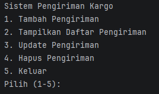
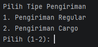
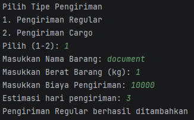
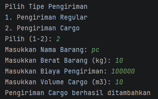
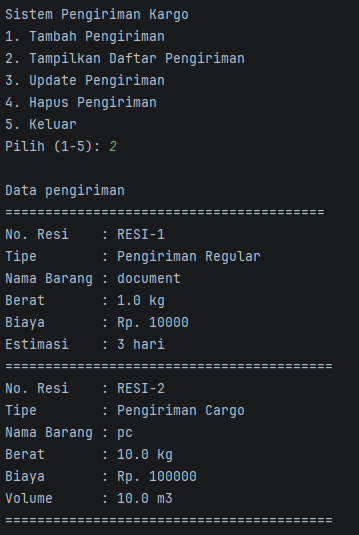
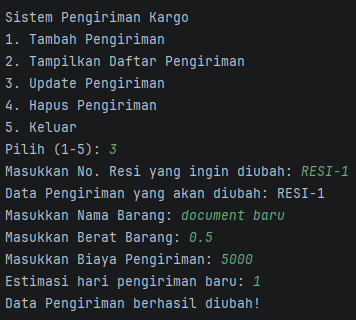
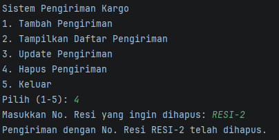

# LAPORAN POSTTEST 3

Proyek ini adalah system aplikasi manajeman pengiriman kargo menggunakan bahasa Java dengan konsep Object Orientation Programming (OOP)

## Identitas

Nama: Muhammad Haykal Makhmud
<br>
NIM: 2409106005

## Deskripsi Program

Program ini merupakan sistem manajemen pengiriman kargo yang dibuat menggunakan bahasa pemrograman Java dengan menerapkan konsep Object-Oriented Programming (OOP). Program ini dirancang untuk mengelola data pengiriman barang dengan operasi Create, Read, Update, dan Delete (CRUD).

**Fitur Utama:**

- Menggunakan inheritance dengan class `Pengiriman` sebagai parent class
- Child class: `PengirimanRegular` (dengan atribut hariPengiriman) dan `PengirimanCargo` (dengan atribut volume)
- Menyimpan semua data pengiriman dalam `ArrayList`
- Setiap pengiriman memiliki data: nomor resi, nama barang, berat barang (kg), dan biaya pengiriman (Rp)
- Terdapat atribut tambahan untuk setiap tipe pengiriman (hari pengiriman untuk regular, volume untuk cargo)
- Nomor resi dibuat secara otomatis dengan format "RESI-X" (X adalah nomor urut)
- Dapat mencari dan mengubah data berdasarkan nomor resi

## Penerapan Konsep OOP

### 1. Encapsulation (Enkapsulasi)

Program ini menerapkan Encapsulation dengan menggunakan 3 jenis Access Modifier:

**a) Access Modifier `protected`**

- Atribut (property) dalam class `Pengiriman` (parent class) dibuat `protected`:
  - `protected String resi`
  - `protected String namaBarang`
  - `protected float beratBarang`
  - `protected int biayaPengiriman`
- Atribut `protected` dapat diakses oleh class itu sendiri dan oleh subclass (child class)
- Ini memungkinkan child class untuk mengakses dan memodifikasi atribut dari parent class

**b) Access Modifier `private`**

- Atribut tambahan di setiap child class dibuat `private`:
  - `private int hariPengiriman` (di class `PengirimanRegular`)
  - `private double volume` (di class `PengirimanCargo`)
- Dengan menjadikan atribut `private`, data hanya dapat diakses dari dalam class tersebut
- Ini melindungi integritas data spesifik setiap tipe pengiriman

**c) Access Modifier `public`**

- Method getter dan setter dibuat `public` untuk akses terkontrol
- User dapat mengakses dan memodifikasi data melalui method ini


### 2. Getter dan Setter

Program ini menerapkan **Getter dan Setter** untuk mengakses dan memodifikasi attribute:

**Getter Methods** (untuk membaca data):

```java
// Dari Parent Class (Pengiriman)
public String getNamaBarang()      // Membaca nama barang
public float getBeratBarang()      // Membaca berat barang
public int getBiayaPengiriman()    // Membaca biaya pengiriman
public String getResi()            // Membaca nomor resi

// Dari Child Class (PengirimanRegular)
public int getHariPengiriman()     // Membaca hari pengiriman

// Dari Child Class (PengirimanCargo)
public double getVolume()          // Membaca volume
```

**Setter Methods** (untuk mengubah data):

```java
// Dari Parent Class (Pengiriman)
public void setNamaBarang(String namaBarang)        // Mengubah nama barang
public void setBeratBarang(float beratBarang)       // Mengubah berat barang
public void setBiayaPengiriman(int biayaPengiriman) // Mengubah biaya pengiriman

// Dari Child Class (PengirimanRegular)
public void setHariPengiriman(int hariPengiriman)   // Mengubah hari pengiriman

// Dari Child Class (PengirimanCargo)
public void setVolume(double volume)                // Mengubah volume
```

### 3. Inheritance (Pewarisan)

Program ini menerapkan **Inheritance** dengan struktur sebagai berikut:

**Parent Class (Superclass): `Pengiriman`**

```java
public class Pengiriman {
    protected String resi;
    protected String namaBarang;
    protected float beratBarang;
    protected int biayaPengiriman;
}
```

**Child Class 1: `PengirimanRegular` extends Pengiriman**

```java
public class PengirimanRegular extends Pengiriman {
    private int hariPengiriman;
}
```

**Child Class 2: `PengirimanCargo` extends Pengiriman**

```java
public class PengirimanCargo extends Pengiriman {
    private double volume;
}
```


## Alur Program

### 1. Menu Utama

Pada menu utama, pengguna akan disajikan 5 pilihan menu:

- Pilihan 1: Tambah Pengiriman
- Pilihan 2: Tampilkan Daftar Pengiriman
- Pilihan 3: Update Pengiriman
- Pilihan 4: Hapus Pengiriman
- Pilihan 5: Keluar



### 2. Tambah Data Pengiriman (Create)

Jika memilih pilihan 1, pengguna akan diminta untuk memilih tipe pengiriman terlebih dahulu:



#### a. Pengiriman Regular

Pengguna dapat menambahkan data pengiriman regular dengan memasukkan nama barang, berat barang, biaya pengriman ditambah dengan estimasi hari pengiriman.



#### b. Pengiriman Cargo

Pengguna dapat menambahkan data pengiriman cargo dengan memasukkan nama barang, berat barang, biaya pengiriman ditambah dengan volume cargo



### 3. Lihat Semua Data Pengiriman (Read)

Jika memilih pilihan 2, sistem akan menampilkan seluruh data pengiriman yang telah disimpan. Pengguna dapat melihat daftar lengkap semua pengiriman (regular dan cargo) yang sudah ditambahkan.



### 4. Update Data Pengiriman (Update)

Jika memilih pilihan 3, pengguna dapat memilih data pengiriman yang ingin diubah dengan memasukkan no resi yang ingin diubah. Setelah resi ditemukan, pengguna dapat mengubah informasi pengiriman yang sudah ada dengan data yang baru.



### 5. Hapus Data Pengiriman (Delete)

Jika memilih pilihan 4, pengguna dapat memilih data pengiriman yang ingin dihapus dari sistem dengan memasukkan no resi yang ingin dihapus.



### 6. Keluar dari Program

Jika memilih pilihan 5, program akan berhenti dan keluar dari aplikasi manajemen pengiriman kargo.
